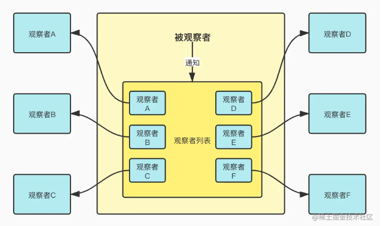
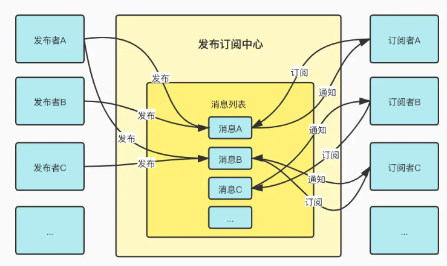

<!-- more -->

## 1. 观察者模式

### 1.1 定义

是一种设计模式。观察者模式 = 观察者 + 被观察者（重点）



### 1.2 实现

观察者模式有一个被观察对象 `Subject`，可以有多个 **观察者**去观察这个对象。二者之间的关系是：==通过 **被观察者主动** 建立的==。

**被观察者**至少有三个方法：

- 添加观察者
- 移除观察者
- 通知观察者

当被观察者将某个观察者添加到自己的 **观察者列表** 后，观察者与被观察者之间就建立起来了。此后只要被观察者在某种时机触发 **通知观察者** 方法时，观察者即可接收来自被观察者的消息了。


**手写实现：**

1. 被观察者 -- `Subject`

   ```javascript
   // 被观察者有一个 观察者列表 observerList
   // 添加观察者、移除观察者、通知观察者
   class Subject{
     constructor(){
       this.observerList = []
     }
     addObserver(observer){
       this.observerList.push(observer)
     }
     removeObserver(observer){
       const index = this.observerList.findIndex(item => item.name === observer)
       this.observerList.splice(index, 1)
     }
     notifyObservers(message){
       this.observerList.forEach(observer => observer.notified(message))
     }
   }
   ```

   

2. 观察者 -- `Observer`

   ```javascript
   class Observer{
     constructor(name, subject){
       this.name = name
       if(subject){
         subject.addObserver(this)
       }
     }
     notified(message){
       console.log(this.name,'got message',message)
     }
   }
   ```

 3. 使用

    ```javascript
    const subject = new Subject()
    
    // 观察者主动申请加入被观察者列表
    const observerA = new Observer('observerA', subject)
    
    // 被观察者主动将观察者加入列表
    const observerB = new Observer('observerB')
    subject.addObserver(observerB)
    
    
    subject.notifyObservers('Hello from subject')
    subject.removeObserver(observerA)
    subject.notifyObservers('Hello again')
    ```

==观察者模式中的被观察者需要在每次自身改变后都绑定式地触发对观察者的通知==

## 2. 发布订阅模式

### 2.1 定义

是一种对象间一对多的依赖关系。发布订阅 = 发布者 + 订阅者 + 发布订阅中心（重点）

发布者和订阅者不直接进行通信，而是发布者将要发布的消息交友中心管理，订阅者也是根据自己的情况，按需订阅中心的消息。

- **订阅者** （`Subscriber`）把自己像订阅的事件 **注册**（Subscribe)）到调度中心
- 当 **发布者**（`Publisher`）**发布该事件**到调度中心，也就是该事件触发时，由 **调度中心**统一调度订阅者注册到调度中心的处理代码



### 2.2 实现

实现思路：

- 创建一个类 `Observer`
- 有一个缓存列表 `message`
- 向消息队列添加内容 `$on`
- 删除消息队列的内容`$off`
- 出发消息队列里的内容`$emit`

#### **1. 创建一个类**

```javascript
class Observer{
  contructor(){ }
}
```

#### **2. 添加三个核心方法**

```javascript
class Observer{
  contructor(){ }
  $on(){ }
  $off(){ }
  $emit(){ }
}
```

创建一个实例，如：

```javascript
class Observer{
  contructor(){ }
  $on(){ }
  $off(){ }
  $emit(){ }
}

// 使用构造函数 创建一个实例
const person1 = new Observer()

// 向 person1 委托一些内容，调用 $on
// 既然要委托一些内容，那 事件名 必不可少，事件触发的时候也需要一个 回调函数
person1.$on('买红宝石', handleA)
person1.$on('买红宝石', handleB)
person1.$on('买奶茶', handleC)

function handleA(){
  console.log('handleA')
}
function handleB(){
  console.log('handleB')
}
function handleC(){
  console.log('handleC')
}
```

#### **3. 设置缓存列表**

缓存列表 `message` 功能如下：

向 `person1` 委托一个 `buy` 类型的内容，完成之后执行回调函数 `handleA` 和 `handleB`

```javascript
class Observer{
  contructor(){
  	this.message = {}  // 消息队列
  }
  $on(){ }
  $off(){ }
  $emit(){ }
}
const person1 = new Observer()

person1.$on('buy', handleA)
person1.$on('buy', handleB)
```

相当于下列效果：

```javascript
class Observer{
  contructor(){
  	this.message = {
      buy: [handleA, handleB]
    }  // 消息队列
  }
  $on(){ }
  $off(){ }
  $emit(){ }
}
```

#### **4. 实现 $on**

`$on`需要传两个参数：

- `type`：事件名（事件类型）
- `cb`：回调函数

每个事件类型对应多个消息（`cb`），所以我们要为每个是事件类型创建一个数组

**实现步骤：**

1. 先判断有没有这个属性（事件类型）
2. 没有 => 初始化一个空数组
3. 有     => 在现有的事件类型中 `push` 一个新的 `cb`

```javascript
class Observer{
  contructor(){
  	this.message = { }  // 消息队列
  }
  $on(type, cb){
    if(!this.message[type]){
      this.message[type] = []
    }
    this.message[type].push(cb)
  }
  $off(){ }
  $emit(){ }
}
```

#### **5. 实现 $off**

`$off` 用来删除消息队列里的内容

有两种写法：

- `person1.$off('buy')` ：删除整个 `buy`事件类型
- `person1.$off('buy'， handleA)` ：只删除`handleA`消息，保留 `buy`事件列表的其他消息

**实现步骤：**

1. 判断是否有订阅，即消息队列里是否有 `type`这个类型的事件，没有 => return
2. 判断是否有 `fn` 这个参数
   - 没有 => 删除整个事件
   - 有     => 仅删除 `fn` 这个消息

```javascript
class Observer{
  contructor(){}
  $on(type, cb){}
  $off(type, cb){ 
  	if(!this.message[type]) return
    if(!cb){
      this.message[type] = undefined
    }
    this.message[type] = this.message[type].filter(item => item !== cb)
  }
}
```

#### **6. 实现$emit**

`$emit` 用来触发消息队列的内容

- 该方法需要传入一个`type`参数，用来确定触发哪一个事件
- 主要流程就是对 `type` 事件做一个 `for` 循环，依次执行每一个消息的回调函数

```javascript
class Observer{
  contructor(){}
  $on(type, cb){}
  $off(type, cb){ }
  $emit(type){ 
    // 判断是否有订阅
  	if(!this.message[type]) return
    // 有订阅，就对type 这个事件做一个轮询
    this.message[type].forEach(item => item())
  }
}
```

### 2.3 完整代码

```javascript
class Observer{
  contructor(){
  	this.message = { }  // 消息队列
  }
  /*
   * $on 向消息队列添加内容
   * type 事件类型
   * cb 回调函数
   */
  $on(type, cb){
    // 判断有没有这个属性
    if(!this.message[type]){
      // 没有，置为空数组
      this.message[type] = []
    }
    // 有，直接在后面添加回调函数
    this.message[type].push(cb)
  }
   /*
   * $off 删除消息队列的内容
   * type 事件类型
   * cb 回调函数
   */
  $off(type, cb){ 
    // 判断是否有订阅 ，没有直接 return
  	if(!this.message[type]) return
    // 判断是都有 cb 这个参数
    if(!cb){
      // 没有，删除整个事件
      this.message[type] = undefined
    }
    // 有cb, 仅删除cb 这个消息（过滤掉这个方法）
    this.message[type] = this.message[type].filter(item => item !== cb)
  }
  /*
   * $emit 触发消息队列的内容
   * type 事件类型
   */
  $emit(type){ 
    // 判断是否有订阅
  	if(!this.message[type]) return
    // 有订阅，就对type 这个事件做一个轮询
    this.message[type].forEach(item => item())
  }
}
```