本文是对 `diff` 算法的整理，主要讲述 `vue2` 和 `vue3` 中 `diff` 算法的实现流程。

<!-- more -->

### 1. 虚拟DOM和diff算法

虚拟`DOM`：用来表示真实 `DOM` 的对象，`vue` 通过模板变生成虚拟 `DOM`树，然后再通过渲染器渲染成真实 `DOM`，当数据更新时，产生新的虚拟 `dom` 树。

`diff` 算法：是一种对比算法。对比两者的旧虚拟 `DOM` 和新虚拟 `DOM`，比较新旧节点，只会在同层级对比，不会跨层级比较。

`diff` 整体策略：==深度优先，同层比较==

### 2. vue2双端diff算法实现

`vue2` 采用 ==双端 `diff` 算法==。核心方法是 ==`updateChildren`==，通过 ==新前与旧前、新后与旧后、新后与旧前、新前与旧后、暴力比对==5种查找。

#### 2.1 新前与旧前

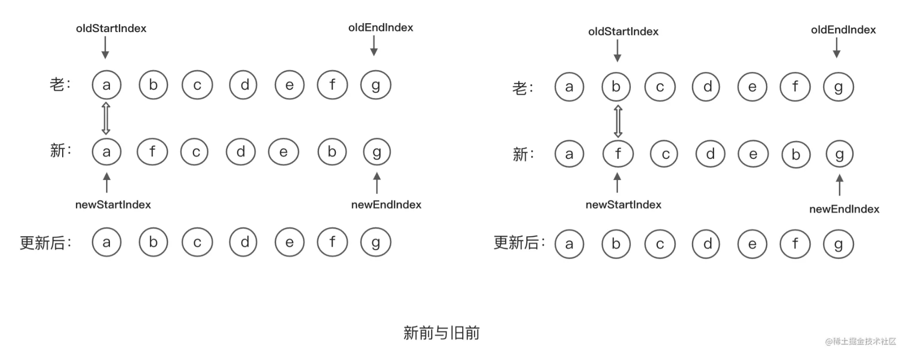

新前与旧前对比：

- 相同，新、老的开始下标往后移动一格，上图中 `a` 的新老节点相同，位置移动到 `b` ，此时新节点为 `f` ，两节点不同
- 不同，进入新后与旧后对比

#### 2.2 新后与旧后

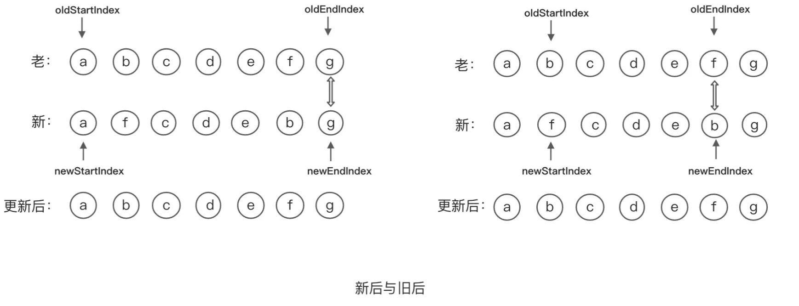

新后与旧后：

- 相同，新、老的结束下标往前移动一格
- 新前与旧前、新后与旧后对比都不同，进行新后与旧前对比

#### 2.3 新后与旧前

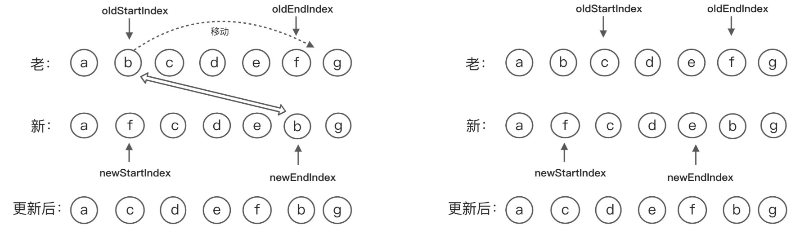

新后与旧前：

- 相同，把老的开始节点移动到老的结束节点前面，老的开始节点下标往后移动一格，新的结束下标往前移动一格
- 新前与旧前、新后与旧后、新后与旧前对比都不同，进入新前与旧后比对

#### 2.4 新前与旧后

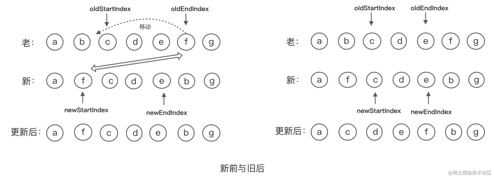

新前与旧后：

- 相同，把老的结束节点移动到老的开始节点前面，然后新的开始下表往后移动一格，老的结束下标往前移动一格

#### 2.5 暴力比对（乱序）

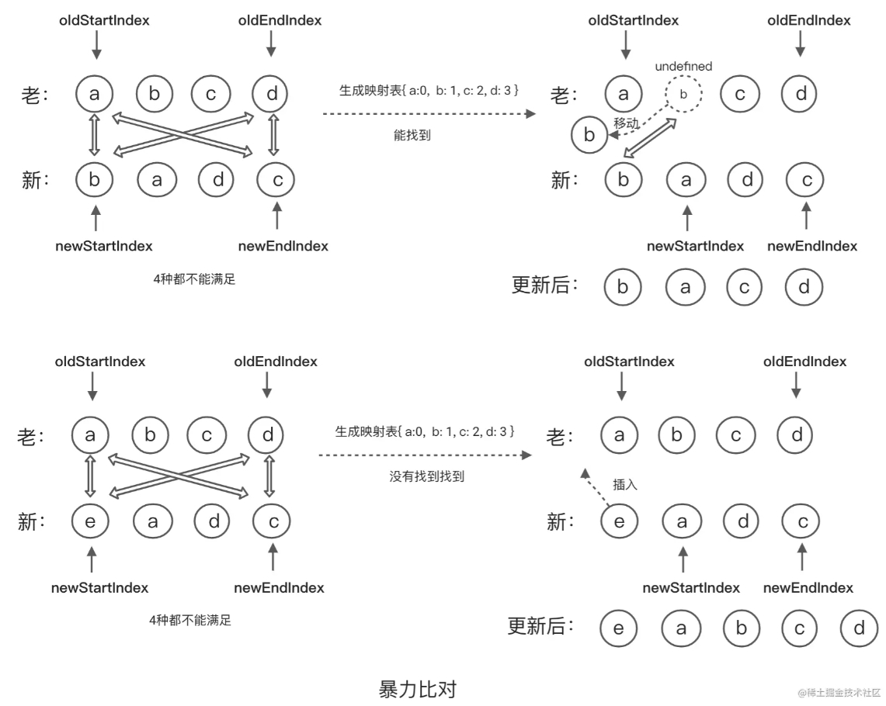

以上4种方法都不适用时，采用最暴力的方法。

- 循环 `oldChildren` 生成一个 `key` 和 `index` 的映射表 `{ 'a':0, 'b':1 }`
- 用新的开始节点的 `key`，去映射表中查找
  - 找到 => 将该节点移动到最前面，原来的位置使用 `undefined` 占位，避免数组塌陷，防止老节点移动走后破坏初始的映射表位置
  - 没有找到 => 直接将新节点插入

#### 2.6 新节点有剩余

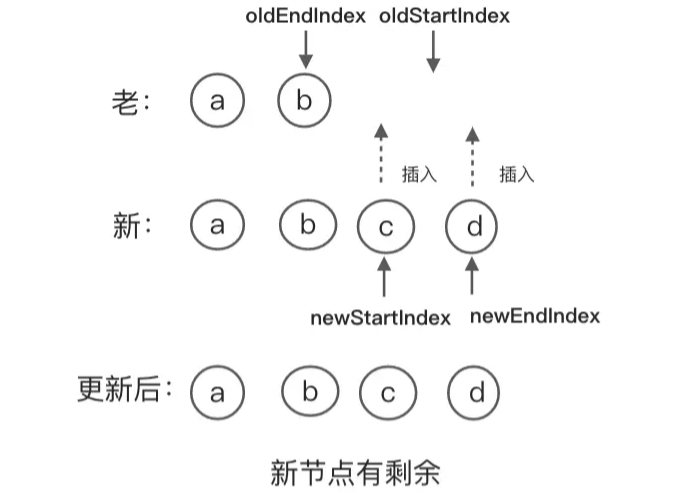

当 `oldStartIndex > oldEndIndex` 时对比结束，新的子节点还有多余节点，需要循环插入多余节点

#### 2.7 老节点有剩余

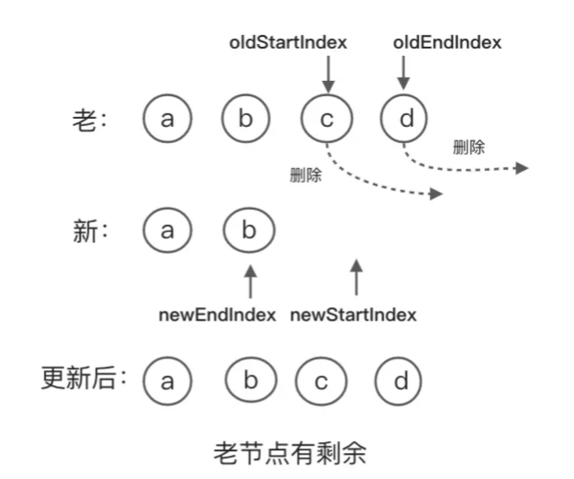

当 `newStartIndex > newOldIndex`时对比结束，老节点还有多余节点时，循环删除多余节点

### 3. vue3快速diff算法实现

借鉴了纯文本 `diff` 算法中的预处理思路，处理新旧两个组子节点中相同的前置节点和后置节点。处理完后，如果剩余节点无法简单的通过挂载新节点或者卸载已经不存在的节点来完成更新，则需要根据**节点的索引关系，构建出一个最长递增子序列**。最长递增子序列所指向的节点即为不需要移动的节点。

#### 3.1 相同前置节点处理

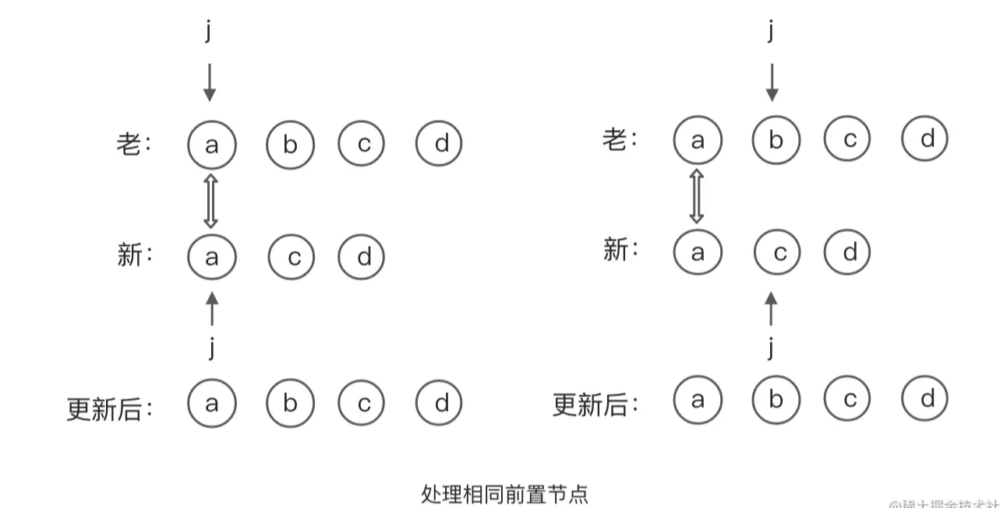

前置节点的处理：

定义一个 `j` 变量，分别指向新、老两给子节点，比较新、老节点是否相同，如果相同指针 +1，直到两个节点不同时结束前置节点的处理

#### 3.2 相同后置节点处理

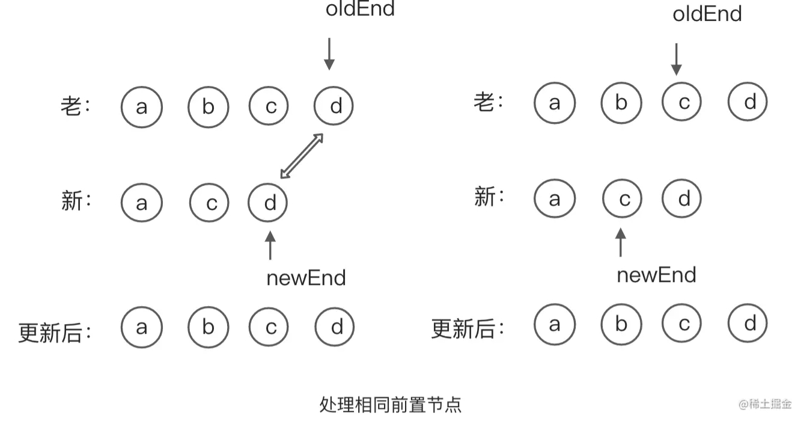

后置节点的处理：

定义一个索引 `oldEnd` 指向旧的一组子节点的最后一个节点和索引 `newEnd` 指向新的一组子节点的最后一个节点。然后比较两个指向的新旧节点，相同指向 +1，知道两个节点不同时结束后置节点的处理

#### 3.3 剩余节点的处理

- 只有新的一组的子节点有剩余

  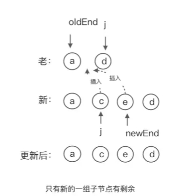

  当条件满足 **`j > oldEnd`** 且 **`j <= newEnd`** 时，表示只有**新子节点还有剩余**，需要循环 `j --> newEnd` 中的节点然后进行**插入**

- 只有旧的一组的子节点有剩余

  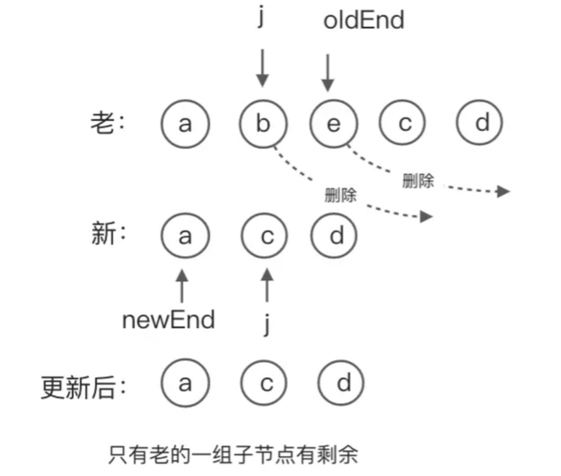

  当条件满足 **`j > newEnd`** 且 **`j <= oldEnd`** 时，表示只有**老子节点还有剩余**，需要循环 `j --> oldEnd` 中的节点然后进行**删除**

- 新老两组的子节点都有剩余

  1. 生成一个 `socurce` 数组，存放新节点在老节点的索引，初始值都为 -1，定义一个变量 `patched` 用于记录，然后遍历新的一组的子节点，构建 `key` 与 `index` 的映射表，最后==遍历老的一组的节点，去映射表中寻找==，`k = keyIndex[oldVnode.key]`，如果找到就把对应的索引存到 `source` 对应的位置中，没有找到说明该节点多余，直接删除

     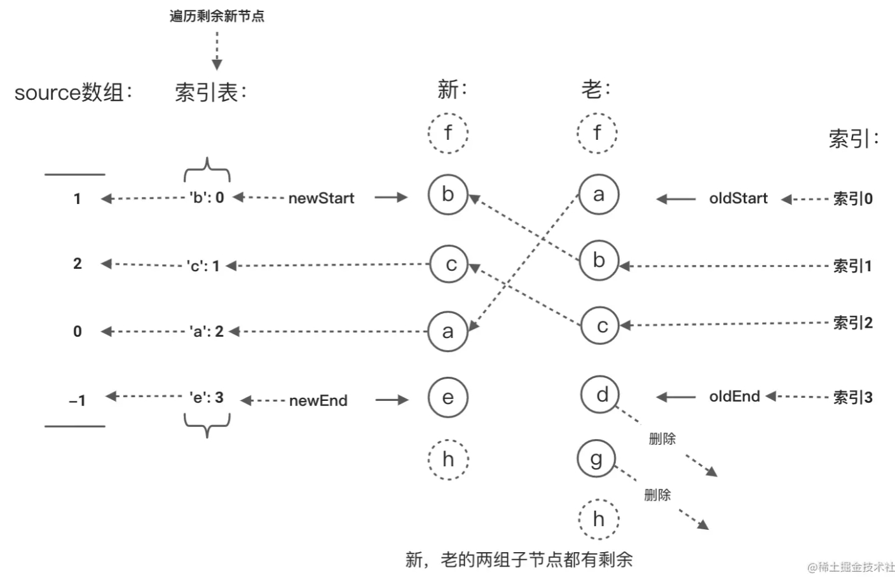

  2. 判断新节点是否需要移动

     - `k`：当前节点在新节点数组中的索引
     - `pos`：上一个节点在新节点数组中的索引
     - `moved`：记录是否需要移动的阈值（`true/false`）

     `k < pos`：新节点的顺序不是升序，需要移动利用最长递增子序列来优化移动逻辑

     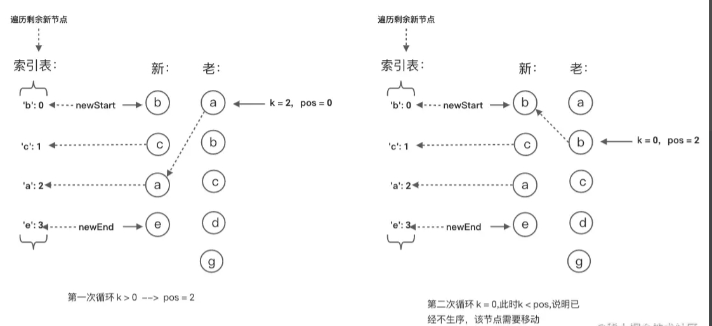

  3. 利用最长递增子序列来优化移动逻辑

     如果 `moved = true`，首先通过最长递增子序列获取到升序列表存放的是索引，然后从后面遍历新的一组节点，节点的索引与升序列表对比，如果对比相同，则不需要移动，否则将该节点所对应的老节点移动到当前位置

     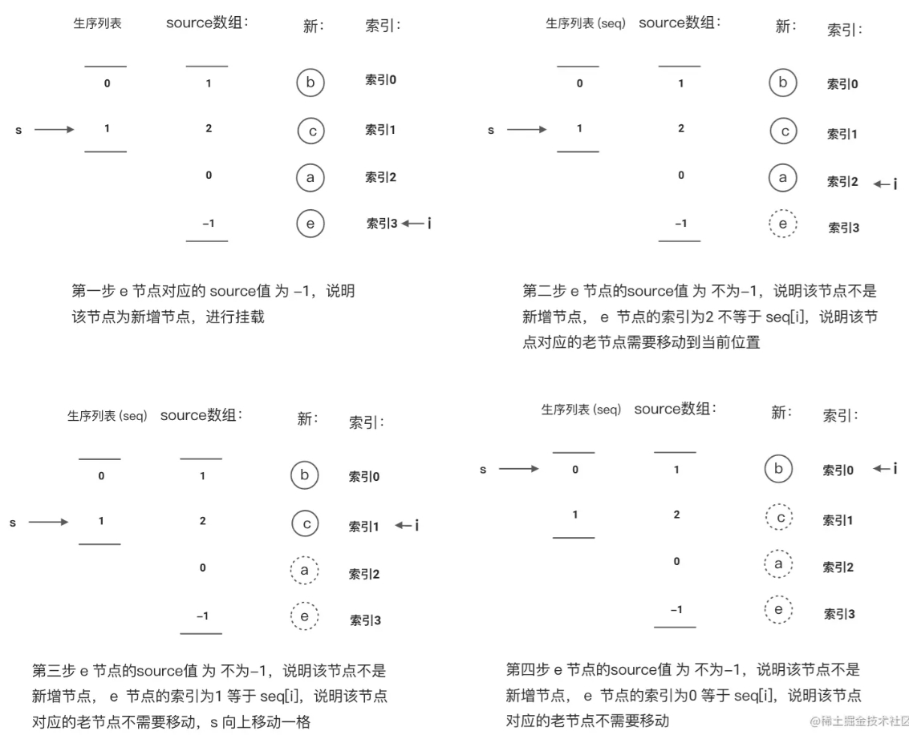

### 4. vue2和vue3的diff区别

- ==`vue2`是全量进行 `diff`，而 `vue3` 使用了静态标记，支队打标记的节点进行 `diff`==

  - `vue2`中的虚拟 `dom` 是进行==全量的对比==，在运行的时候会对所有节点生成一个虚拟节点树，当页面数据发生变更后，会遍历判断虚拟 `dom`所有的节点（包括一些不会变化的节点）有没有变化

  - `vue3` 相对于 `vue2`中增加了静态标记，在模板编译时，编译器会在动态标签末尾加上 `/* Text*/ PatchFlag`。==在生成 `VNode` 时，同时打上标记==，`patch` 过程中就会判断这个标记来 `Diff` 优化流程，跳过一些静态节点对比

- ==处理完首尾节点后，对剩余节点的处理方式==

  - `vue2`中通过对旧节点列表建立一个 `{key:index}` 的映射表，然后遍历新节点列表的剩余节点，通过key去映射表中查找，找到 就移动到最前，原来位置为 `undefined`，没有找到就插入
  - `vue3`时建立一个存储新节点的剩余节点在旧节点上的索引的映射关系数组，找到最长递增子序列，然后从后遍历，将新节点数组的剩余节点移动到正确位置
