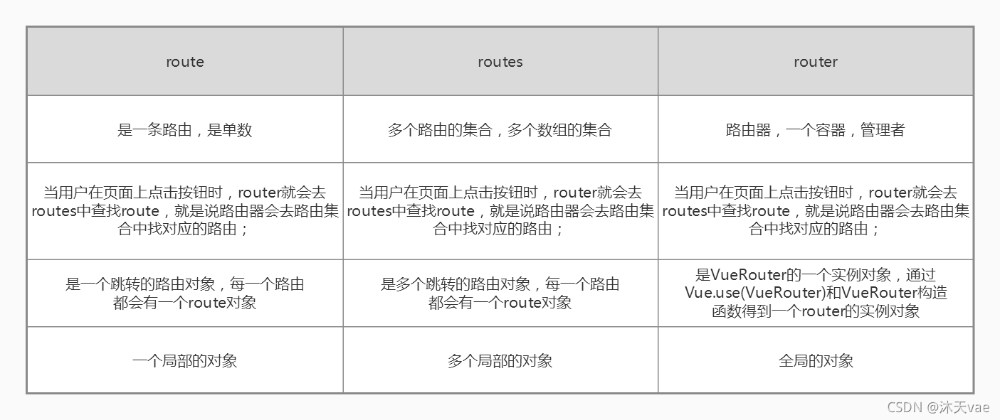

全局路由钩子：`beforeEach(to, form, next)`、`afterEach(to, from)`

独享路由钩子：`beforeEnter(to, from, next)`

组件内路由钩子：`beforeRouterEnter(to, from, next)`、`beforeRouteLeave(to, from, next)`

<!-- more -->

### 1. 路由分类

- 前端路由
- 后端路由

### 2. 基本路由

**使用方法：**

1. 安装 `vuerouter`，执行命令：`npm i vue-router`
2. 在 `vue` 后面引入：`import VueRouter from 'vue-touter' `
3. 使用插件：`Vue.use(VueRouter)`
4. 编写 `router` 配置项：

```javascript
import VueRouter from 'vue-router'
Vue.use(VueRouter)

import About from '../About'
import Home from '../Home'

const router = new VueRouter({
  routers:[
    {
      path:'/about',
      component: About
    },
    {
      path:'/home',
      component: Home
    },
  ]
})
```

### 3. 多级路由

```js
 routers:[
  {
    path:'/about',
    component: About
  },
  {
    path:'/home',
    component: Home,
    children: [              // 通过 children 配置子级路由
      {
        path: 'news',
        component: News,
        children: [
          name:'hello',      // 给路由命名
          path: 'welcome',
          component: Hello
        ]
      }
    ]
  },
  ]
```

跳转：

```vue
<router-link to="/home/news"> 跳转到news组件 </router-link>

// 命名路由
<router-link to="/home/news/welcome"> 跳转到news组件 </router-link>
// 简化跳转
<router-link :to="{name: 'hello'}">跳转 </router-link>
// 简化后传递参数
<router-link 
  :to="{
    name:'hello',
    query:{
      id: 666,
      title: "你好"
    }
  }"
>跳转</router-link>
```

### 4. 路由参数

#### 4.1 query参数

- 传递参数

  ```vue
  // 跳转携带 query 参数，to 的字符串写法
  <router-link :to="/home/news/detail?id=666&title=你好">跳转</router-link>
  
  // 跳转携带 query 参数，to 的对象写法
  <router-link 
    :to="{
      path:'/home/news/detail',
      query:{
        id: 666,
        title: "你好"
      }
    }"
  >跳转</router-link>
  ```

- 接收参数

  ```vue
  $route.query.id
  $route.query.title
  ```

#### 4.2 params参数

- 配置路由

  ```js
  // 路由配置
  {
  	path: 'detail/:id',  // :xxx 是占位符，接收的params参数
  	name: 'detail',
  	component: Detail
  }
  
  // 列表中跳转
  this.$router.push({
    path:`/datail/${id}`
  })
  ```

- 传递参数

  ::: note

  路由携带 `params` 参数时，若使用 `to` 的对象写法，则不能使用 `path` 配置项，必须使用 `name` 配置

  :::

  ```vue
  // 跳转携带 params 参数，to 的字符串写法
  <router-link :to="/home/news/detail/666">跳转</router-link>
  
  // 跳转携带 params 参数，to 的对象写法
  <router-link 
    :to="{
      name:'hello',
      params:{
        id: 666
      }
    }"
  >跳转</router-link>
  ```

- 接收参数

  ```vue
  $route.params.id
  ```

### 5. replace属性

1. 作用：控制路由跳转时操作浏览器历史记录的模式
2. 浏览器的历史记录有两种写入方式：`push` 和 `replace`
   - `push` ：追加历史记录
   - `replace` ：替换当前记录
3. 开启 `replace` 模式：`<router-lunk replace...>跳转</router-link>`

### 6. 编程式路由导航

使用方法：

```js
this.$router.push({
  name:'hello',
  params:{
    id:xxx,
  }
})
this.$router.replace({
  name:'hello',
  params:{
    id:xxx
  }
})
this.$router.forward()   // 前进
this.$router.back()      // 后退
this.$router.go()        // 可前进也可后退
```

### 7. 缓存路由组件

1. 作用：让不展示的路由组件保持挂载，不被销毁

2. 使用方法：

   ```vue
   // 缓存一个路由组件
   <keep-alive include="News">
     <router-view></router-view>
   </keep-alive>
   
   // 缓存多个路由组件
   <keep-alive include="['News','Message']">
     <router-view></router-view>
   </keep-alive>
   ```

### 8. 路由守卫

1. 作用：对路由进行权限控制
2. 分类：全局守卫、独享守卫、组件内守卫
3. 参数：
   - `to`：目标路由对象
   - `from`：即将要离开的路由对象
   - `next`：是一个函数，表示放行
     - 必须调用 `next()` 才能继续执行下一个钩子，否则路由跳转会停止
     - `next(false)`：中断跳转
     - `next('/')` 或者 `next({path: '/'})`：跳转到指定页面

#### 8.1 全局守卫

- 前置守卫(`beforeEach`)

  全局前置守卫，初始化时执行，每次路由切换前执行

  一般用于登录验证、权限判定

  ```javascript
  router.beforeEach(to, from, next){
  	if(to.meta.isAuth){ // 判断当前路由是否需要进行权限控制
      if(localStroage.getItem('school') === 'xx'){  // 权限控制具体规则
        next()
      }else{
        alert("没有权限访问")
      }
    }else{
      next()
    }
  }
  ```

- 后置守卫(`afterEach`)

  全局后置守卫，初始化时执行，每次路由切换后执行

  ```js
  router.afterEach(to, from){
    if(to.meta.title){
      document.title = to.meta.title   // 修改网页的title
    }else{
      document.title = 'init_title
    }
  }
  ```

#### 8.2 独享守卫

- `breforeEnter`：指在单个路由配置时的钩子函数

```js
const router = new VueRouter({
  routers:[
    {
      path:'/foo',
      component: Foo,
      beforeEnter:(to, from, next) => {
        // ...
      }
    }
  ]
})
```

#### 8.3 组件内守卫

- `beforeRouterEnter`：进入守卫，通过路由规则，进入该组件时被调用
- `beforeRouterLeave`：离开守卫，通过路由规则，离开该组件时被调用

```js
beforeRouterEnter(to, from, next){
  ...
}
beforeRouterLeave(to, from, next){
  ...
}
```

### 9. $router和$route

#### 9.1  this.$router

`$router`：表示一个全局的路由对象，`vue-router` 的实例，提供 `addRouters`、`back`等方法，相当于一个路由的管理者角色。

- `this.$router.options.routes()`：获取当前的路由配置
- `router.forward()`：导航前进一步，但是不刷新前进页的表单，类似 `router.go(1)`
- `$router.push()`
- `$router.replace()`

#### 9.2 this.$route

`$route`：表示当前路由对象，包含具体的路由名称、`path`、`query`、`params` 等属性

- `$route.path`：字符串，当前路由对象的路径，如：`/home/news`

- `$route.query`：对象，包含路由的 `query` 参数的键值对。

  如：`/home/news?id=1&name=qq`    ===>   `{"id": 1, "name": "qq"}`

- `$route.name`：当前路径的名字，如果没有使用具名路径，则为空

- `$route.router`：路由规则所属的路由器（以及其所属的组件）

- `$route.matched`：数组，包含当前匹配的路径中的所有片段所对应的配置参数对象

- `$route.params`：对象，键值对参数

#### 9.3 区别



### 10. 路由生命周期

1. 导航被触发
2. 在失活的组件里调用 `beforeRouterLeave` 离开守卫
3. 调用全局守卫 `beforeEach`守卫
4. 在重用的组件内调用 `beforeRouteUpdate`守卫
5. 在路由配置里嗲用 `beforeEnter`守卫
6. 解析异步路由组件
7. 在被激活的组件内调用 `beforeRouteEnter`守卫
8. 调用全局的 `beforeResolve` 守卫
9. 导航被确认
10. 调用全局 `afterEach` 钩子
11. 触发 `DOM` 更新
12. 用创建好的 实例调用 `beforeRouteEnter` 守卫中传给 `next()` 的回调函数
