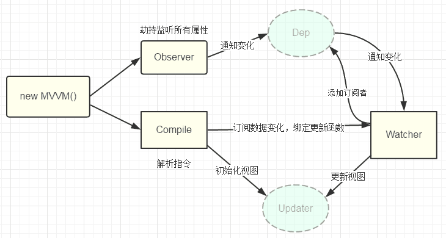

vue2.0双向绑定原理 使用 `MVVM` 架构，只需关注业务层逻辑，不需要手动操作 `DOM`

<!-- more -->

### 1. 什么是双向绑定

用户更新了 `View`，`Model`也自动更新

### 2. 双向绑定部分组成

双向绑定由三个重要部分组成：

- 数据层（`Model`）：应用的数据及业务逻辑
- 视图层（`View`）：应用的展示效果，各类 `UI`组件
- 业务逻辑层（`ViewModel`）：框架封装的核心，负责将视图和数据连接起来

`ViewModel` 的主要职责：

- 数据变化更新视图
- 视图变化更新数据

`ViewModel`  的两个主要组成部分：

- 监听器（`Observer`）：对所有数据的属性进行监听
- 解析器（`Compiler`）：对每个元素节点的指令进行扫描跟解析，根据指令模板替换数据以及绑定相应的更新函数

### 3. 双向绑定原理

两个阶段：

- 初始化阶段：数据监听、页面渲染
- 数据更新阶段

::: info 参考答案

- `Vue2.0` 采用数据劫持结合发布订阅模式的方式，通过 `Object.defineProperty` 来劫持各个属性的 `getter` 、`setter`，在数据变动时发布消息给订阅者 `Watcher` ，触发相应的监听回调。

- 当把一个普通的 `javascript` 对象传给 `Vue` 实例来作为它的 `data` 选项时， `Vue` 将遍历它的属性，通过 `Object.defineProperty` 将它们转化为 `getter/setter` 进行数据监听。

- `Vue` 的数据双向绑定整合了 `Observer` 、`Compile`、`Watcher` 三者，通过 `Observer` 来监听自己的 `model` 的数据变化，通过 `Compile` 来解析模板指令，最终利用 `Watcher` 搭起  `Observer` 和`Compile`之间的桥梁，达到数据变化 -> 视图更新，视图交互变化 -> 数据 `model`变更的双向绑定效果。

- 数据 `data` 变化  -->  `Observer` 中的 `setter` 触发 `Dep.notify()`  -->  `Dep` 开始遍历所有的订阅者，对 `Watcher` 发送通知  -->  触发 `update()`  -->  `Watcher` 收到 `Dep`的通知  -->  相应视图更新

 :::

**流程：**

1. `new Vue()` 执行初始化，对 `data` 执行相应化处理，这个过程发生在 `Observer`中
2. `Compile` 对模板进行编译，找到其中动态绑定的数据，从 `data` 中获取并初始化视图
3. 同时定义一个更新函数（`update`）和 `Watcher`，将来数据变化时 `Watcher` 会调用更新函数
4. 由于 `data` 的某个 `key` 在一个视图中可能出现多次，所以每个 `key` 都需要一个管家 `Dep` 来管理多个 `Watcher`
5. `data`  数据变化，首先会找到 对应的`Dep`，通知所有 `Watcher`执行更新函数

### 4. v-model 双向绑定原理

::: info 参考答案

`v-model` 本质就是 `value + input` 方法的语法糖。可以通过 `model` 属性的 `prop` 和 `event` 属性来进行自定义。原生的 `v-model`，会根据标签的不同生成不同的事件和属性。

- `text` 和 `textarea`：`value` + `input()`
- `checkbox` 和 `redio`：`checked` + `change()`
- `select` 将 `value` 作为 `prop` ，并将 `change` 作为事件

:::

### 5. 问题

- `object.defineProperty()` 不能监听对象的添加和删除，但是可以利用 `Vue.set` 或者 `this.$set`  来解决此问题。
- `object.defineProperty()` 无法监听数组下标的变化，导致通过数组下标添加的元素，不能实时响应
- `object.defineProperty()`  只能劫持对象的属性
