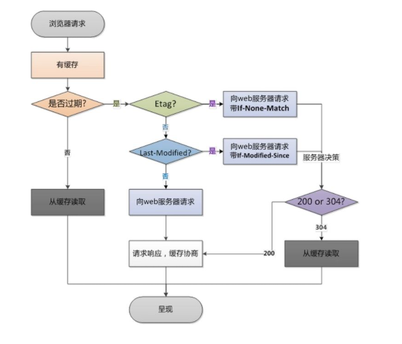
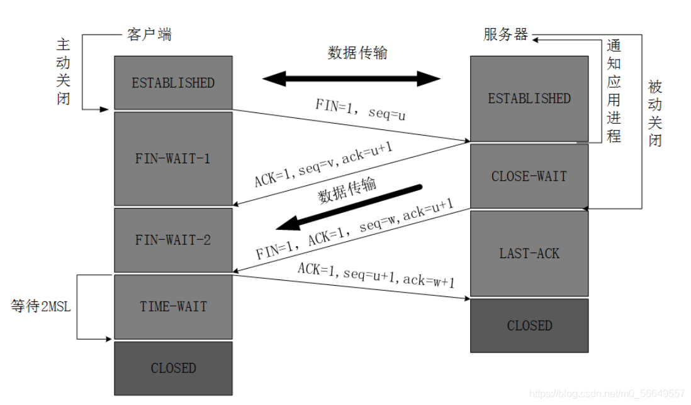

http、https、tcp/ip等

<!-- more -->

## 1. HTTP与HTTPS

### 1.1 区别

::: info 参考答案

- `https` 是 `http` 协议的安全版本，`http` 协议的数据传输是明文的，是不安全的， `https` 使用了 `SSL/TLS` 协议进行加密处理，==相对安全==
- `http` 和 `https` 使用连接方式不同，默认==端口号不同== ， `http` 是 80，`https` 是443
- `https` 需要==多次加密及多次握手==，性能不如 `http`
- `https` 需要 `SSL`证书，是需要钱的

:::

### 1.2 HTTPS如何保证安全

`HTTPS = HTTP+ TLS/SSL`  采用 `SSL` 证书进行加密

`SSL` 的实现主要依赖于三种手段：

- 对称加密：采用协商的密钥对数据加密

  加密和解密的密钥使用的都是同一个，是对称的。

- 非对称加密：实现身份认证和密钥协商

  存在两个密钥，一个公钥，一个私钥。公钥可以公开给任何人使用，私钥则需要保密

  公钥加密后只能用私钥解密，私钥加密后只能公钥解密

- 摘要算法：验证信息的完整性

  特殊的压缩算法，它能够把任意长度的数据“压缩”成固定长度、而且独一无二的“摘要”字符串，就好像是给这段数据生成了一个数字“指纹”

- 数字签名：身份验证

  能够确定消息是由发送方签名并发出的，因为别人假冒不了发送方的签名

  就是用私钥加密，公钥解密

### 1.3 HTTP1.0/1.1/2.0

::: tabs

@tab HTTP1.0

- 浏览器和服务器只保持 ==短暂的连接==，浏览器每次请求都需要与服务器建立一个 `TCP` 连接

@tab HTTP1.1

- ==长连接==，即 `TCP` 连接默认不关闭，可以被多个请求复用
- 在同一个 `TCP` 连接中，客户端可以同时发送多个请求（至多6个）
- 所有数据通信是 ==按顺序执行== 的，服务器只有处理完一个请求，才会处理下一个请求
- 新增一些请求方法： `put`、`delete`、`option`等
- 新增一些请求头和响应头：
  - 引入更多的缓存控制策略：`if-Match` 、`if-None-Match`
  - 引入 `rang`，允许值请求资源某个部分
  - 引入 `host`，实现了在一台服务器上可以在同一个 `IP ` 地址和端口号上使用不同的主机名来创建多个虚拟 `WEB` 站点

@tab HTTP2.0

- 实现 ==多路复用== ，而非有序并阻塞的，只需要一个连接就可以实现 ==并行==
- 采用 ==二进制格式传输== 数据而非文本格式
- 使用==报头压缩==，节省开销
- ==服务器推送==，允许服务端推送资源给客户端

:::


**为什么 HTTP1.1 不能实现多路复用?**

::: info 参考答案

HTTP1.1 不是二进制传输，而是通过文本进行传输。由于没有流的概念，在使用并行传输（多路复用）传递数据时，接收端在接收响应后，并不能区分多个响应对应的请求，所以无法将多个响应的结果重新进行组装，因此不能实现多路复用。

:::


### 1.4 HTTP常见状态码

状态码第一位数字决定不同响应状态：

- 1 表示消息
- 2 表示成功
- 3 表示重定向
- 4 表示请求错误
- 5 表示服务器错误


#### 1xx

表示请求已经被接受，需要继续处理

- **100（临时响应）**：用来通知客户端它的部分请求已经被服务器接收，且仍未被拒绝。客户端应当继续发送剩余部分的请求，如果请求已经完成，忽略这个响应。服务器必须在请求完成后向客户端发送一个最终响应
- 101：根据客户端请求切换协议，用于 `websocket/http2`

#### 2xx

代表请求已成功被服务器接收、理解、并接受

- 200（成功）：
- 201（已创建）：请求成功并且服务器创建了新的资源
- 202 （已创建）：请求成功，尚未处理
- 203（非授权信息）：已成功处理请求，但返回的信息可能来自另一资源
- 204（无内容）
- **206（部分内容）**：服务器成功处理了部分请求，断点续传

#### 3xx

表示要完成请求，需要进一步操作，**重定向**

- **301（永久重定向）**：请求的网页已永久移动到新位置，对 `get/head`请求的响应自动跳转到新位置
- **302（临时重定向）**
- **304（协商缓存）**：告诉客户端有缓存，直接用缓存中的数据，返回页面的只有头部信息，没有内容部分
- 305（使用代理）：通过代理访问请求的网页
- 307（临时重定向）

#### 4xx

表示客户端看起来可能发生了错误

- **400（错误请求）**：语法错误
- 401（未授权）：请求要求身份认证，如登录页
- **403（禁止）**：服务器拒绝请求
- **404（未找到）**
- 405（方法禁用）
- 406（不接受）：无法使用请求的内容响应请求的网页
- 407（需要代理授权）
- 408（请求超时）

#### 5xx

表示服务器在处理请求的过程中有错误或者异常状态发生

- 500（服务器内部错误）
- 502（错误网关）
- **503（服务器不可用）**：停机维护时可用
- **504（网关超时）**
- 505（HTTP版本不支持）


## 2. 强缓存和协商缓存

`http` 缓存机制主要在 `http` 响应头中设定，`Expires`、`Cache-Control`、`Last-Modified`、`Etag`

### 2.1 强缓存

**浏览器不会像服务器发送任何请求**，直接从本地缓存中读取并返回200状态码

**`header` 参数**：

- `Expires`：过期时间，浏览器会在设置的时间内直接读取缓存，不再请求
- `Cache-Control`：
  - `max-age`：设置强制缓存时间
  - `public`：响应可以被任何缓存区缓存，CDN可以缓存
  - `private`：只针对个人用户，不能被代理服务器缓存
  - `no-cache`：协商缓存
  - `no-store`：禁止缓存，直接拉去最新的资源

### 2.2 协商缓存

向服务器发送请求，服务器会根据这个请求的 `header` 的一些参数来判断是否命中协商缓存

**`header` 参数**：

- ==`Etag/if-None-Match`==
  - `Etag`：
  - `if-None-Match`：
    - 当资源过期时，有 `Etag`, 则再次请求时带上请求头 `if-None-Match`，
    - 和服务器进行比对
    - 对比后不同，返回200（请求响应，协商缓存），对比相同返回304（从缓存中读取）
- ==`Last-Modified/if-Modified-Since`==
  - `Last-Modified`：浏览器向服务器发送资源最后修改的时间
  - `if-Modified-Since`：
    - 当资源过期时，有 `Last-Modified` ，则再次请求时带上请求头 `if-Modified-Since` ，表示请求时间。
    - 服务器收到请求后 对比 `Last-Modified`和 `if-Modified-Since`
    - `Last-Modified` > `if-Modified-Since`，返回最新资源，`HTTP 200 OK`
    - `Last-Modified ` < `if-Modified-Since`，走缓存，`HTTP 304`

:::note

- `Last-Modified/if-Modified-Since` 的时间精度是秒，而 `Etag` 更精确
- `Etag` 优先级高于 `Last-Modified/if-Modified-Since` 
- `Last-Modified/if-Modified-Since`  是 `http1.0` 的头字段

:::


强制缓存与协商缓存的流程图如下所示：



## 3. 网络七层模型

### 3.1 `TCP/IP`四层模型


### 3.2 `TCP/IP`七层模型


- 物理层：实现计算机节点之间比特流的透明传送，点对点
- 数据链路层：使用各种协议传送
- 网络层（IP层）：通过源IP地址和目的IP地址进行连接
- 数据传输层：主要通过 `TCP`（可靠） 和 `UDP`（不可靠）传输数据，可以携带 `data`、`headers`、`body`等数据
- 会话层
- 表示层
- 应用层：`HTTP`、`FTP`、`SMTP`协议等

### 3.3 `UDP` 和 `TCP`

::: tabs

@tab UDP

==不可靠==

- 传输途中出现丢包， `UDP` 也不负责重发
- 不提供复杂的控制机制，利用 `IP` 提供无连接的通信服务
- 传递包时会出现顺序乱的问题
- 无法进行流量控制等避免网络阻塞的行为

@tab:active TCP

==可靠==

- 向服务器发送数据时会通知是否成功
- 充分实现了数据传输时的各种控制功能，可以进行丢包时的重发控制，对次序乱掉的分包进行顺序控制

:::

## 4. 三次握手和四次挥手

### 4.1 `TCP` 协议

即传输控制协议。是一种面向连接、可靠的数据传输协议。

**面向连接**：数据传输之前客户端和服务端必须建立连接

**可靠**：数据传输是有序的，要对数据进行校验

### 4.2 `TCP` 包首部

- `TCP` 端口号

  `TCP` 连接需要：（源 `IP` ，源端口号）+ （目的 `IP` ，目的端口号）

  端口号范围 1024 - 65535

- `TCP` 序列号和确认号

  - ==**`seq`**== ：序列号，用来确认发送的数据**有序**
  - ==**`ack`**==：确认号，对上一次 `seq` 序号做出的确认号，用来响应 `TCP` 报文段，给收到的报文段的序号== **`seq+1`**==

- `TCP` 标志位

  - ==**`SYN`**==：同步标志位，建立会话连接，==同步序列号==
  - ==**`ACK`**==：确认标志位，对已接收的数据包进行==确认==
  - ==**`FIN`**==：完成标志位，表示已经没有数据发送了，即将==关闭连接==

### 4.3 三次握手

定义：指建立一个 `TCP` 连接树，需要客户端和服务器端总共发送**3个报文**。

目的：确认双方（客户端和服务端）的接收和发送能力是否正常。

示例：王和陈打电话：

    王：你好，陈，听的到吗？
    陈：听到了，王，你能听到吗？
    王：听到了，今天一起吃饭？

**三次握手步骤：**


1. 客户端 --> 服务端：`SYN = 1, seq= x`  ，客户端此时处于 `SYN_RCVD` ==同步已发送== 状态
2. 服务端 --> 客户端：`ACK = 1, SYN = 1, ack = x+1, seq = y`，服务端此时处于 `SYN_RCVD` ==同步已接收== 状态
3. 客户端 --> 服务端：`ACK = 1, ack = y+1, seq = x+1` ，客户端和服务器端进入`ESTABLISHED` ==已连接== 状态


**为什么要进行三次握手？**

::: info 参考答案

主要原因：**防止已经失效的连接请求报文突然又传送到了服务器，从而产生错误**

- 第一次握手：客户端向服务端发送报文，证明客户端发送能力正常
- 第二次握手：服务端接收报文并向客户端发送报文，证明服务端接收能力、发送能力正常
- 第三次握手：客户端向服务端发送报文，证明客户端接收能力正常

:::

### 4.4 四次挥手

示例: 王和陈对话：

    王：好的，那我先走了
    陈：好的，那你走吧
    陈：那我也走了？
    王：好的，你走吧

**四次挥手步骤：**



假如客户端先发送关闭请求：

1. 客户端 --> 服务端：`FIN = 1, seq = u`（u 为前面已经传送过来的数据最后一个字节的序号+1），客户端此时处于 `FIN-WAIT-1` ==终止等待1== 状态
2. 服务端 --> 客户端：`ACK = 1, ack = u+1, seq = v`，服务端此时处于 `CLOSE-WAIT` ==关闭等待== 状态
3. 服务端 --> 客户端：`FIN = 1, ACK = 1, ack = u+1, seq = w`，服务器此时进入 `LAST-ACK` ==最后确认== 状态
4. 客户端 --> 服务端：`ACK = 1, ack = w+1, seq = u+1`，客户端进入 `TIME-WAIT` ==时间等待== 状态，但此时 `TCP`连接还未终止，必须要经过 `2MSL`（最长报文寿命），客户端才进入 `CLOSED`状态


**挥手为什么需要四次？**

::: info 参考答案

​		因为当服务器收到客户端的 `SYN` 连接请求报文后，可直接发送 `SYN + ACK`报文。`ACK`报文用来应答， `SYN` 报文用来同步。

​		但是关闭连接时，当服务端收到 `FIN` 报文时，很可能==不会立即关闭 `SOCKET` ，所以只能先回复 `ACK` 报文==，告诉客户端，“你发的 `FIN` 报文我收到了”。==只有等到服务器所有的报文都发送完了，服务器才会发送 `FIN`报文，因此不能一起发送==，故需要四次挥手。

:::


**四次挥手释放连接时，等待 `2MSL` 的意义？**

::: info 参考答案

- 保证客户端发送的最后一个 `ACK` 报文能够到达服务器

- 防止已失效的连接请求报文文段出现在本连接中

  客户端在发送完最后一个ACK报文段后，在经过 `2MSL`，就可以使本连接持续的时间内所产生的所有报文段都从网络中消失，使下一个新的连接中不会出现这种旧的连接请求报文段。

:::


**为什么 `TIME_WAIT` 状态要等待 `2MSL`才能返回到 `CLOSE`状态？**

::: info 参考答案

理论上，四个报文都发送完毕，就可以直接进入 `CLOSE` 状态，但是可能网络不是可靠的，有可能最后一个 `ACK`丢失，所以 `TIME_WAIT`就是用来重发可能丢失的 `ACK`报文。

:::

## 5. GET和POST区别

::: tabs

@tab get

- 拼接 `url`
- 限制字符串长度
- 有缓存

@tab post

- 数据在 `body` 中传递
- 没有缓存
- 相对 `get` 更安全

:::

::: info 参考答案

- 浏览器在发送 `get` 请求时，不会携带请求体
- `get` 适合传少量数据，`post`没有限制
- 大部分 `get` 请求是在 `path`参数中，会暴露数据
- 刷新页面时，若当前页面是 `get`请求，则没有提示，`post`会提示用否是否重新提交
- `get`请求的地址会被保存为浏览器书签

:::


## 6. CDN

## 7. 从输入URL到获取页面完整过程

::: info 参考答案

1. 判断是否有缓存，有缓存直接返回，没有则进行下一步
2. `DNS`解析，获取源 `IP` 地址和目标 `IP`地址
3. 进行 `TCP`连接 ，三次握手
4. 发送 `http` 请求，服务端根据请求响应数据
5. 渲染页面，构建 `DOM` 树
5. 关闭 `TCP` 连接

:::

## 8. cookie、localStroage、sessionStroage

::: tabs

@tab Cookie

- 大小：4kb
- 可设置失效时间
- 请求携带在 http

@tab LocalStroage

- 大小无限制
- 除非手动删除，否则永久有效
- 客户端缓存
- 不参与和服务器的通信

@tab SessionStroage

- 大小无限制
- 当前会话下有效
- 客户端保存
- 不参与和服务器通讯

:::


::: info 参考答案

- 存储大小：`cookie`：4k，`sessionStroage`、`localStroage`：5M或更大
- 有效时间：`cookie`：设置的过期时间内有效，`sessionStroage`在当前会话内有效，`localStroage` 除非手动删除，否则永久有效
- 数据与服务器之间的交互方式：`cookie`的数据会自动传递到服务器，`sessionStroage`和`localStroage` 仅本地保存，不会发给服务器

:::


## 9. CSR、SSR、SSG

::: tabs

@tab CSR

客户端渲染

优点：

- 前后端分离
- 服务器压力变轻
- 用户在后期访问操作体验好，（首屏喧染慢）可以将网站做成 `SPA`，可以增量渲染

缺点：

- 首屏渲染时间过长，不利于首屏渲染
- 不利于 `SEO`，因为搜索引擎不执行相关 `JS`操作，无法获取选然后的最终 `html`

@tab SSR

服务端渲染

优点：

- 有利于 `SEO`
- 有利于首屏渲染，首屏渲染时间变短

缺点：

- 占用服务端资源，渲染工作都在服务端渲染
- 用户体验不好，每次跳转到新页面都需要服务器重新渲染整个页面，不能只渲染可变区域

@tab SSG

静态资源生成，一般用于博客搭建

缺点：

- 只适用于静态资源

:::

## 10. 跨域

::: info 参考答案

1. 代理 `proxy`

2. `cros`

   在请求时，客户端使用一些特殊的请求头向服务器申请跨域访问，并通过这些请求头告诉服务器自己的行为。服务器根据自身的规则决定是否允许跨域，如果允许，则通过响应头告诉客户端可以发送跨域请求。

3. `JSONP`（只支持 `get` 请求）

   1. 事先准备一个处理服务器数据的全局函数，用来接收数据

      ```javascript
      function func(){...}
      ```

   2. 创建一个 `sript` 标签，`src` 指向跨域站点，同时把准备好的函数名通过地址参数传递到服务器

      ```html
      <script src = "......./callback=func">
      ```

   3. 客户端通过 `src` 向服务端发送请求，服务端接收并响应数据 `data`

   4. `func('+JSON.stringify(data)')` 以参数的形式返回，运行 `func` 函数

:::

## 11. 优化网络性能

::: info 参考答案

1. 优化打包体积

2. 压缩

3. 缓存

4. CDN

5. http2

   开启多路复用、头部压缩等特点，充分利用带宽传递大量文件数据

6. 雪碧图

7. defer、async

   通过 `defer`、`async` 属性，可以让页面尽早加载 `js`文件

   - `defer`：**渲染完在执行**。要等到整个页面在内存中正常渲染结束（DOM 结构完全生成，以及其他脚本执行完成），才会执行

   - `async`：**下载完就执行**。一旦下载完成，渲染引擎就会中断渲染，执行这个脚本以后，再继续渲染

8. prefetch、preload

   `preload`：对于当前页面很有必要的资源。尽早加载首屏的关键资源，提升页面渲染性能。一些隐藏在 CSS、JS中的资源（字体文件）

   `prefetch`：对于可能在将来的页面中使用的资源，异步加载模块

:::
